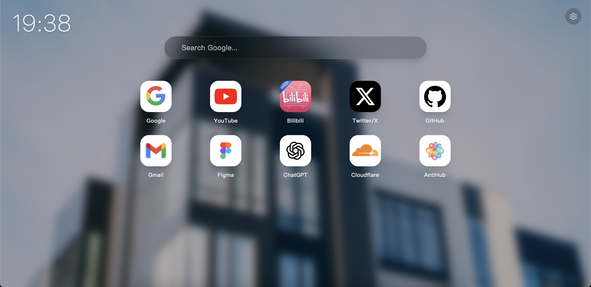
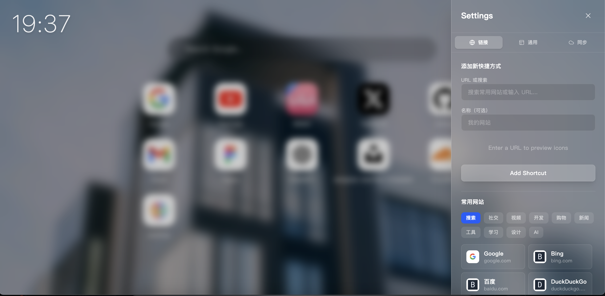
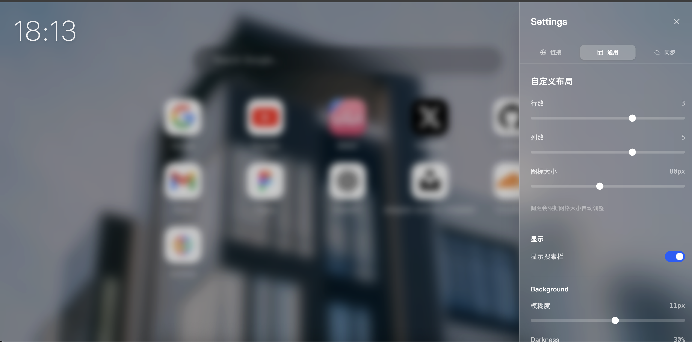
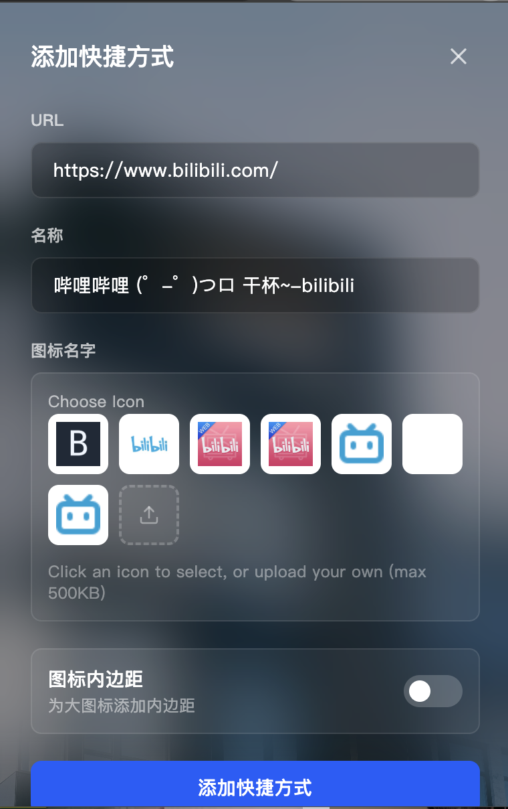

# Aesthetic New Tab (极简新标签页)

一个美观、可定制且支持同步的 Chrome 新标签页扩展。专注于美学设计、性能和易用性。










## ✨ 主要功能

- **🎨 精美设计**: 采用玻璃拟态 (Glassmorphism) UI 设计，搭配来自 Unsplash 的动态背景。
- **⚡️ 高度定制**: 可自由调整网格的行数、列数和图标大小，打造专属布局。
- **🔄 云端同步**: 使用安全的 Cloudflare Worker 后端，在不同设备间无缝同步您的快捷方式和设置。
- **📱 响应式布局**: 完美适配各种屏幕尺寸和窗口大小。
- **🔒 隐私优先**: 数据完全掌握在您手中。同步功能可选且安全。
- **⌨️ 智能快捷方式**: 快速添加网站，自动获取并适配图标。


## 🚀 快速开始

### 环境要求

- Node.js (v16 或更高版本)
- npm 或 yarn

### 安装步骤

1. **克隆仓库**
   ```bash
   git clone https://github.com/jiangnan1224/AestheticNewTab.git
   cd AestheticNewTab
   ```

2. **安装依赖**
   ```bash
   npm install
   ```

3. **开发模式**
   ```bash
   npm run dev
   ```

4. **构建生产版本**
   ```bash
   npm run build
   ```

### 加载到 Chrome

1. 打开 Chrome 浏览器，访问 `chrome://extensions/`。
2. 打开右上角的 **开发者模式 (Developer mode)** 开关。
3. 点击 **加载已解压的扩展程序 (Load unpacked)**。
4. 选择构建生成的 `dist` 文件夹。

## ☁️ 使用Cloudflare部署同步服务 

同步功能依赖于 Cloudflare Worker。

1. 复制 [worker.js](https://github.com/jiangnan1224/AestheticNewTab/blob/main/worker/worker.js)的内容到 Cloudflare Worker，部署一个新的worker项目，名称随意。

2. 配置 KV 命名空间
   - 在 Cloudflare 控制台创建一个 KV 命名空间。
   - 将其绑定到您的 worker，名称设为 `SYNC_KV`。

## 更新同步地址

1. fork本项目。

2. 更新 `syncService.js` 中的 `SYNC_URL` 为您的 worker URL。   

3. 到项目的Actions中，点击`Build Chrome Extension`，打包插件。

## 📝 许可证

本项目采用 MIT 许可证 - 详情请参阅 [LICENSE](LICENSE) 文件。

## 🤝 贡献

欢迎提交 Pull Request 来改进这个项目！
